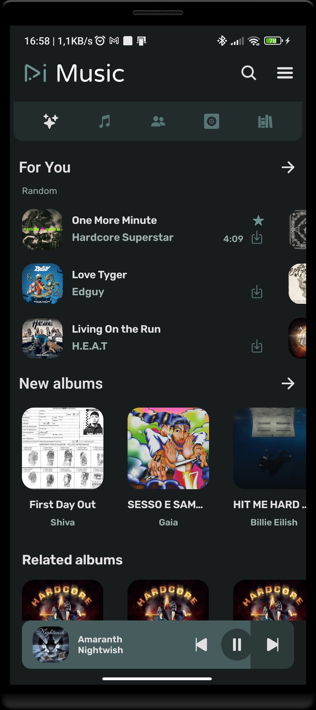
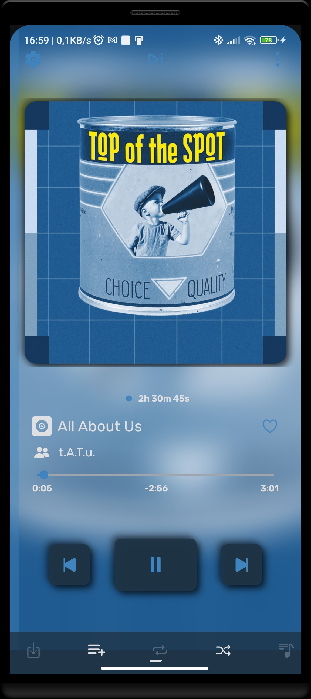
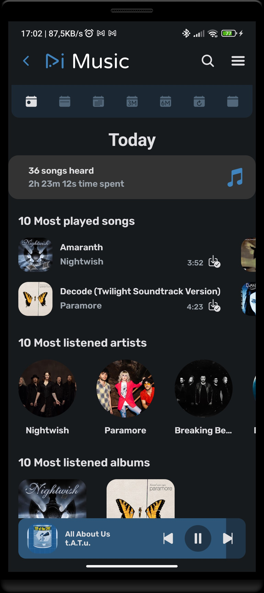
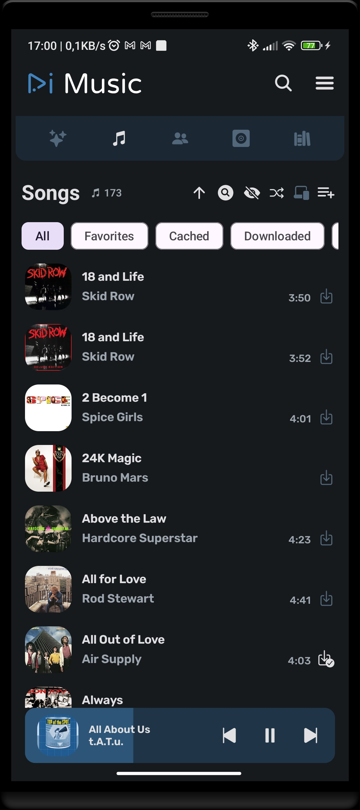
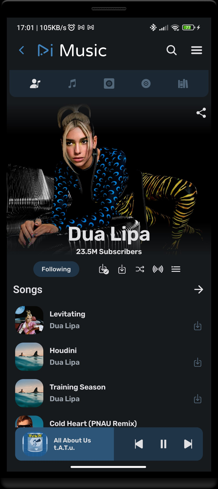
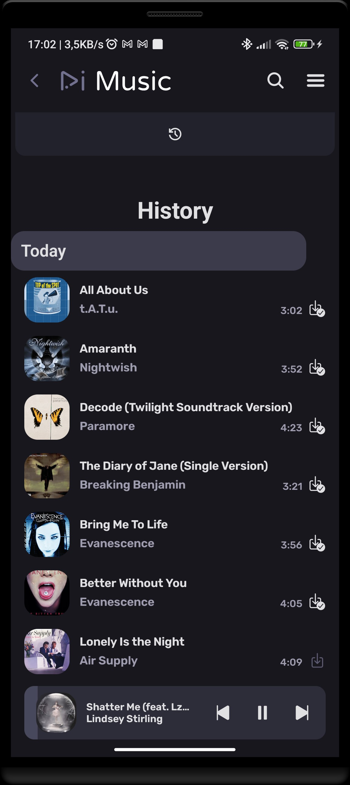

      
  
<b>RiMusic</b> is a <b>multilingual</b> Android application for streaming music from YouTube Music.

  
It began as an <b>extension</b> of <b>ViMusic</b>, then acquired its own identity.

<b>It allowing the user to customize it at will.</b>

<b>RiMusic does not collect any data.</b>

  
  
  

## ✨ Features
- **Multilingual:** English, Italian, German, Russian, French, Spanish, Czech, Turkish, Romanian and more. Contributions for other languages are welcome
- UI Mode, change style from RiMusic to classic ViMusic style and viceversa
- Auto cache songs for offline playback with a custom cache size
- Download songs or entire playlists for offline playback (not cache) 
- Background playback
- Listening statistics
- Audio visualizer on player with many type of effects. THIS FEATURES REQUIRE MIC PERMISSION, ONLY AVAILABLE IF ACTIVATED FROM SETTINGS. BY DEFAULT IT IS DISABLED [Full list of permissions](https://github.com/fast4x/RiMusic/wiki/FAQs#what-permissions-are-used)
- News, mood and musical genres, new albums from favourite artists
- Import/Export online, RiMusic playlists, can share with friend all RiMusic playlists
- Fetch, display, edit and translate synchronized, or not, songs lyrics
- Customizable themes
- Sleep timer with customizable time
- Audio control: volume app and device, playback speed and pitch, normalization, skip silence
- Android Auto, Android TV, YT Video support
- Widgets (experiment)
- Check for Updates, which can be enabled or disabled in settings

## 📷 Screenshots

  
  
  
  
  
  

## 🌐 Languages available
- **Afrikaans** thanks to [HelloZebra1133](https://crowdin.com/profile/HelloZebra1133)
- **Arabic:** thanks to [ABS zarzis](https://crowdin.com/profile/abszar) and [Ahmad Al Juwaisri](https://crowdin.com/profile/juwaisri)
- **Azerbaijani** thanks to [Nizami Səmidov](https://crowdin.com/profile/nizamismidov4) and [Notesuree](https://github.com/Notesuree)
- **Bangla:** thanks to [Ann Naser Nabil](https://github.com/AnnNaserNabil)
- **Bashkir:** thanks to [Shilave malay](https://crowdin.com/profile/Bash.boy)
- **Catalan:** thanks to [Adrià Martínez](https://crowdin.com/profile/marxally) and [Aniol](https://crowdin.com/profile/aniol) and [EMC_Translator](https://crowdin.com/profile/EMC_Translator)
- **Chinese Simplified:** thanks to [benhaotang](https://crowdin.com/profile/benhaotang) and [SharkChan0622](https://github.com/SharkChan0622)
- **Chinese Traditional:** thanks to [YeeTW](https://github.com/yjcTW) and [SharkChan0622](https://github.com/SharkChan0622)
- **Czech:** thanks to [ikanakova](https://github.com/ikanakova) and [JZITNIK-github](https://github.com/JZITNIK-github)
- **Danish** thanks to [cultcats](https://crowdin.com/profile/cultcats)
- **Dutch:** thanks to [BabyBenefactor](https://crowdin.com/profile/BabyBenefactor)
- **English:** thanks to [Alejandro Moctezuma](https://crowdin.com/profile/alejandromoc) and [twistios](https://crowdin.com/profile/twistios) and [Smk90](https://crowdin.com/profile/smk90) and [CanIn](https://crowdin.com/profile/canin) and [koliwan](https://crowdin.com/profile/koliwan) and [Glich440](https://github.com/Glich440) and [fast4x](https://github.com/fast4x)
- **Esperanto:** thanks to [kefiiris](https://github.com/kefiiris)
- **Estonian** thanks to [beez276](https://crowdin.com/profile/beez276)
- **Filipino** thanks to [Clyde-Timonera](https://github.com/Clyde-Timonera)
- **Finnish:** thanks to [Smk90](https://crowdin.com/profile/smk90) and [rikalaj](https://crowdin.com/profile/rikalaj)
- **French:** thanks to [Mickael81](https://crowdin.com/profile/mickael81) and [esophagusdecency](https://crowdin.com/profile/esophagusdecency) and [Mickael81](https://github.com/Mickael81) and [NEVARLeVrai](https://github.com/NEVARLeVrai)
- **Galician:** thanks to [zordor](https://crowdin.com/profile/zordor) and [ninjum](https://crowdin.com/profile/ninjum)
- **German:** thanks to [twistqj](https://crowdin.com/profile/twistqj) and [nitro4542](https://crowdin.com/profile/nitro4542) and [twistios](https://crowdin.com/profile/twistios) and [Edward Schreiber](https://crowdin.com/profile/eddisch2010) and [materialred](https://crowdin.com/profile/materialred) and [OlimitLolli](https://crowdin.com/profile/OlimitLolli) and [Lolozweipunktnull](https://crowdin.com/profile/Lolozweipunktnull) and [Seryoga1984](https://crowdin.com/profile/Seryoga1984) and [Conk](https://crowdin.com/profile/conk) and [siggi1984](https://github.com/siggi1984)
- **Greek:** thanks to [Marinkas](https://github.com/Marinkas)
- **Hebrew:** thanks to [opcitgv](https://crowdin.com/profile/opcitgv) and [TheCreeperDuck](https://crowdin.com/profile/thecreeperduck)
- **Hindi:** thanks to [NikunjKhangwal](https://crowdin.com/profile/nikunjkhangwal) and [Sharunkumar](https://crowdin.com/profile/sharunkumar) and [Th3-C0der](https://github.com/Th3-C0der)
- **Hungarìan:** thanks to [Zan1456](https://crowdin.com/profile/Zan1456) and [Ndvok](https://crowdin.com/profile/ndvok)
- **Italian:** thanks to [Fabio Iotti](https://crowdin.com/profile/bruce965) and [agefcgo](https://crowdin.com/profile/agefcgo) and [CiccioDerole](https://crowdin.com/profile/CiccioDerole) and [fast4x](https://github.com/fast4x)
- **Indonesian:** thanks to [luthfialfarabi](https://crowdin.com/profile/luthfialfarabi) and [teddysulaimanGL](https://github.com/teddysulaimanGL) and [Fausta Ahmad](https://crowdin.com/profile/faustaahmad)  
- **Interlingua** thanks to [softinterlingua](https://github.com/softinterlingua)
- **Japanese:** thanks to [maboroshin](https://crowdin.com/profile/maboroshin) and [Mid_Vur_Shaan](https://crowdin.com/profile/Mid_Vur_Shaan)
- **Malayalam** thanks to [XDreamist](https://crowdin.com/profile/xdreamist)
- **Korean:** thanks to [ZeroZero00](https://crowdin.com/profile/ZeroZero00) and [TsyQax](https://crowdin.com/profile/TsyQax)
- **Norwegian:** thanks to [Xyrcon](https://crowdin.com/profile/xyrcon)
- **Odia:** thanks to [redpanda9348](https://crowdin.com/profile/redpanda9348) and [Get100percent](https://github.com/Get100percent)
- **Persian:** thanks to [CUMOON](https://github.com/CUMOON)
- **Polish:** thanks to [Krzysztof](https://crowdin.com/profile/scrummybingus) and [severitysingular](https://crowdin.com/profile/severitysingular) and [Zduniusz](https://crowdin.com/profile/zduniusz) and [AntoniNowak](https://crowdin.com/profile/AntoniNowak) and [roklc](https://github.com/roklc) and [Adam Kop](https://crowdin.com/profile/damianadam000)
- **Portuguese:** thanks to [Juan Ignacio Tejera](https://crowdin.com/profile/originaljuani) and [ManuelCoimbra](https://crowdin.com/profile/ManuelCoimbra) and [NEVARLeVrai](https://github.com/NEVARLeVrai)
- **Portuguese, Brazilian:** thanks to [vs-machado](https://crowdin.com/profile/vs-machado) and [luxdev01](https://crowdin.com/profile/luxdev01) and [VitoriaLima1802](https://crowdin.com/profile/vitorialima1802) and [xSyntheticWave](https://crowdin.com/profile/xSyntheticWave) and [RegularWater](https://crowdin.com/profile/RegularWater) and [NEVARLeVrai](https://github.com/NEVARLeVrai)
- **Romanian:** thanks to [OrangeZXZ](https://github.com/OrangeZxZ)
- **Russian:** thanks to [Edward Schreiber](https://crowdin.com/profile/eddisch2010) and [Michael Müller](https://crowdin.com/profile/xqzme1337) and [HighMode](https://crowdin.com/profile/highmode) and [koliwan](https://crowdin.com/profile/koliwan) and [Nebula-Mechanica](https://crowdin.com/profile/Nebula-Mechanica) and [Alnoer](https://crowdin.com/profile/Alnoer) and [kptmx](https://crowdin.com/profile/kptmx) and [Crayz310](https://github.com/Crayz310) and [Vladimir](https://crowdin.com/profile/vladimir15426) and [@siggi1984](https://github.com/siggi1984)
- **Serbian (Cyrillic, Latin)** thanks to [IvanMaksimovic77](https://github.com/IvanMaksimovic77)
- **Spanish:** thanks to [MS-PC](https://crowdin.com/profile/ms-pc) and [Alejandro Moctezuma](https://crowdin.com/profile/alejandromoc) and [Juan Ignacio Tejera](https://crowdin.com/profile/originaljuani) and [iOSStarWorld](https://crowdin.com/profile/iosstarworld) and [Corotyest](https://crowdin.com/profile/corotyest) and [DanielSevillano](https://github.com/DanielSevillano) and [Fabian Urra](https://crowdin.com/profile/nsagcl)
- **Sinhala:** thanks to [VINULA2007](https://crowdin.com/profile/VINULA2007)
- **Swedish:** thanks to [sebbe.ekman](https://crowdin.com/profile/sebbe.ekman) and [Dženan](https://crowdin.com/profile/Dženan)
- **Tamil** thanks to [Vignesh-p-s](https://crowdin.com/profile/vignesh-p-s)
- **Turkish:** thanks to [abfreeman](https://github.com/abfreeman) and [2010furs](https://github.com/2010furs) and [Muha Aliss](https://crowdin.com/profile/muhaaliss)
- **Telugu** thanks to [SureshTimma](https://crowdin.com/profile/sureshtimma)
- **Ukrainian:** thanks to [Avin](https://crowdin.com/profile/avinateachip) and [[Michael Müller](https://crowdin.com/profile/xqzme1337) and [NiXT0y](https://crowdin.com/profile/nixt0y) and [Crayz310](https://github.com/Crayz310) 
- **Vietnamese:** thanks to [teaminh](https://crowdin.com/profile/teaminh)

## 📲 Installation

[](https://apps.obtainium.imranr.dev/redirect?r=obtainium://app/%7B%22id%22%3A%22it.fast4x.rimusic%22%2C%22url%22%3A%22https%3A%2F%2Fgithub.com%2Ffast4x%2Frimusic%22%2C%22author%22%3A%22fast4x%22%2C%22name%22%3A%22RiMusic%22%2C%22preferredApkIndex%22%3A0%2C%22additionalSettings%22%3A%22%7B%5C%22includePrereleases%5C%22%3Afalse%2C%5C%22fallbackToOlderReleases%5C%22%3Atrue%2C%5C%22filterReleaseTitlesByRegEx%5C%22%3A%5C%22%5C%22%2C%5C%22filterReleaseNotesByRegEx%5C%22%3A%5C%22%5C%22%2C%5C%22verifyLatestTag%5C%22%3Afalse%2C%5C%22dontSortReleasesList%5C%22%3Afalse%2C%5C%22useLatestAssetDateAsReleaseDate%5C%22%3Afalse%2C%5C%22trackOnly%5C%22%3Afalse%2C%5C%22versionExtractionRegEx%5C%22%3A%5C%22%5C%22%2C%5C%22matchGroupToUse%5C%22%3A%5C%22%5C%22%2C%5C%22versionDetection%5C%22%3Atrue%2C%5C%22releaseDateAsVersion%5C%22%3Afalse%2C%5C%22useVersionCodeAsOSVersion%5C%22%3Afalse%2C%5C%22apkFilterRegEx%5C%22%3A%5C%22%5C%22%2C%5C%22invertAPKFilter%5C%22%3Afalse%2C%5C%22autoApkFilterByArch%5C%22%3Atrue%2C%5C%22appName%5C%22%3A%5C%22%5C%22%2C%5C%22shizukuPretendToBeGooglePlay%5C%22%3Afalse%2C%5C%22allowInsecure%5C%22%3Afalse%2C%5C%22exemptFromBackgroundUpdates%5C%22%3Afalse%2C%5C%22skipUpdateNotifications%5C%22%3Afalse%2C%5C%22about%5C%22%3A%5C%22RiMusic%20is%20a%20multilingual%20Android%20application%20for%20streaming%20music%20from%20YouTube%20Music.%20It%20began%20as%20an%20extension%20of%20ViMusic%2C%20then%20acquired%20its%20own%20identity.%20It%20allowing%20the%20user%20to%20customize%20it%20at%20will.%5C%22%7D%22%2C%22overrideSource%22%3Anull%7D)

## ❗ CUSTOM VERSION
WARNING, the custom version is not an official release, download only if invited by the developer!
[Go to custom version](https://github.com/fast4x/RiMusic/tree/master/customVersion)

## ❓ FAQs
- See [Wiki page FAQs](https://github.com/fast4x/RiMusic/wiki/FAQs)
- [Group on Telegram ](https://t.me/rimusic_app)
- [Community on Reddit](https://www.reddit.com/r/RiMusicApp/)
- [Server on Discord](https://discord.gg/y7NJwdwXEM) 

## 🤝 Contributing
**Pull requests are welcome**
- If you want:
    - to **develop new functions** or **fix a bug**, fork the repository and send a pull request.
    - to **translate** or **improve a translation** read the section Translations

### 🔤 Translations
- Go to [Crowdin](https://crowdin.com/project/rimusic/invite?h=73f0e6b64be1c64a8aebd467d286cf851925330) and help with the translations.

### 🤝 **Developer / Designer that contribute:**

<table>
<tr>
    <td align="center" style="word-wrap: break-word; width: 90.0; height: 90.0">
        <a href=https://github.com/fast4x>
            
             
            <b>Rino Russo</b>
        </a>
    </td>
    <td align="center" style="word-wrap: break-word; width: 90.0; height: 90.0">
        <a href=https://github.com/vfsfitvnm>
            
             
            <b>vfsfitvnm</b>
        </a>
    </td>
    <td align="center" style="word-wrap: break-word; width: 90.0; height: 90.0">
        <a href=https://github.com/aneesh1122>
            
             
            <b>aneesh1122</b>
        </a>
    </td>
    <td align="center" style="word-wrap: break-word; width: 90.0; height: 90.0">
        <a href=https://github.com/knighthat>
            
             
            <b>Knight Hat</b>
        </a>
    </td>
    <td align="center" style="word-wrap: break-word; width: 90.0; height: 90.0">
        <a href=https://github.com/twistios>
            
             
            <b>twistios</b>
        </a>
    </td>
    <td align="center" style="word-wrap: break-word; width: 90.0; height: 90.0">
        <a href=https://github.com/martkol>
            
             
            <b>martkol</b>
        </a>
    </td>
</tr>
<tr>
    <td align="center" style="word-wrap: break-word; width: 90.0; height: 90.0">
        <a href=https://github.com/ikanakova>
            
             
            <b>ikanakova</b>
        </a>
    </td>
    <td align="center" style="word-wrap: break-word; width: 90.0; height: 90.0">
        <a href=https://github.com/NEVARLeVrai>
            
             
            <b>NΞVΛR</b>
        </a>
    </td>
    <td align="center" style="word-wrap: break-word; width: 90.0; height: 90.0">
        <a href=https://github.com/Abhinavreddy-B>
            
             
            <b>Abhinav Reddy Boddu</b>
        </a>
    </td>
    <td align="center" style="word-wrap: break-word; width: 90.0; height: 90.0">
        <a href=https://github.com/jzitnik-dev>
            
             
            <b>Jakub Žitník</b>
        </a>
    </td>
    <td align="center" style="word-wrap: break-word; width: 90.0; height: 90.0">
        <a href=https://github.com/OrangeZXZ>
            
             
            <b>OrangeZXZ</b>
        </a>
    </td>
    <td align="center" style="word-wrap: break-word; width: 90.0; height: 90.0">
        <a href=https://github.com/siggi1984>
            
             
            <b>siggi1984</b>
        </a>
    </td>
</tr>
<tr>
    <td align="center" style="word-wrap: break-word; width: 90.0; height: 90.0">
        <a href=https://github.com/DanielSevillano>
            
             
            <b>Daniel</b>
        </a>
    </td>
    <td align="center" style="word-wrap: break-word; width: 90.0; height: 90.0">
        <a href=https://github.com/KyNarec>
            
             
            <b>KyNarec</b>
        </a>
    </td>
    <td align="center" style="word-wrap: break-word; width: 90.0; height: 90.0">
        <a href=https://github.com/coolcarp>
            
             
            <b>coolcarp</b>
        </a>
    </td>
    <td align="center" style="word-wrap: break-word; width: 90.0; height: 90.0">
        <a href=https://github.com/kaanelloed>
            
             
            <b>David</b>
        </a>
    </td>
    <td align="center" style="word-wrap: break-word; width: 90.0; height: 90.0">
        <a href=https://github.com/AnnNaserNabil>
            
             
            <b>Ann Naser Nabil</b>
        </a>
    </td>
    <td align="center" style="word-wrap: break-word; width: 90.0; height: 90.0">
        <a href=https://github.com/DarkCrypt>
            
             
            <b>DarkCrypt</b>
        </a>
    </td>
</tr>
<tr>
    <td align="center" style="word-wrap: break-word; width: 90.0; height: 90.0">
        <a href=https://github.com/muhaaliss>
            
             
            <b>Muha Aliss</b>
        </a>
    </td>
    <td align="center" style="word-wrap: break-word; width: 90.0; height: 90.0">
        <a href=https://github.com/sayyid5416>
            
             
            <b>Sayyid</b>
        </a>
    </td>
    <td align="center" style="word-wrap: break-word; width: 90.0; height: 90.0">
        <a href=https://github.com/S0nter>
            
             
            <b>Sonter</b>
        </a>
    </td>
    <td align="center" style="word-wrap: break-word; width: 90.0; height: 90.0">
        <a href=https://github.com/bbyeen>
            
             
            <b>Matt</b>
        </a>
    </td>
    <td align="center" style="word-wrap: break-word; width: 90.0; height: 90.0">
        <a href=https://github.com/sharunkumar>
            
             
            <b>Sharun</b>
        </a>
    </td>
    <td align="center" style="word-wrap: break-word; width: 90.0; height: 90.0">
        <a href=https://github.com/KalyaSc>
            
             
            <b>KalyaSc</b>
        </a>
    </td>
</tr>
<tr>
    <td align="center" style="word-wrap: break-word; width: 90.0; height: 90.0">
        <a href=https://github.com/Bnyro>
            
             
            <b>Bnyro</b>
        </a>
    </td>
    <td align="center" style="word-wrap: break-word; width: 90.0; height: 90.0">
        <a href=https://github.com/25huizengek1>
            
             
            <b>25huizengek1</b>
        </a>
    </td>
    <td align="center" style="word-wrap: break-word; width: 90.0; height: 90.0">
        <a href=https://github.com/wispl>
            
             
            <b>wispl</b>
        </a>
    </td>
    <td align="center" style="word-wrap: break-word; width: 90.0; height: 90.0">
        <a href=https://github.com/Craeckie>
            
             
            <b>Craeckie</b>
        </a>
    </td>
    <td align="center" style="word-wrap: break-word; width: 90.0; height: 90.0">
        <a href=https://github.com/offa>
            
             
            <b>offa</b>
        </a>
    </td>
    <td align="center" style="word-wrap: break-word; width: 90.0; height: 90.0">
        <a href=https://github.com/lrusso96>
            
             
            <b>Luigi Russo</b>
        </a>
    </td>
</tr>
<tr>
    <td align="center" style="word-wrap: break-word; width: 90.0; height: 90.0">
        <a href=https://github.com/locxter>
            
             
            <b>Luca Schultz</b>
        </a>
    </td>
    <td align="center" style="word-wrap: break-word; width: 90.0; height: 90.0">
        <a href=https://github.com/davidsalido>
            
             
            <b>davidsalido</b>
        </a>
    </td>
    <td align="center" style="word-wrap: break-word; width: 90.0; height: 90.0">
        <a href=https://github.com/ARBoyGo>
            
             
            <b>ARBoyGo</b>
        </a>
    </td>
    <td align="center" style="word-wrap: break-word; width: 90.0; height: 90.0">
        <a href=https://github.com/Surendrajat>
            
             
            <b>Surendrajat</b>
        </a>
    </td>
    <td align="center" style="word-wrap: break-word; width: 90.0; height: 90.0">
        <a href=https://github.com/sriio>
            
             
            <b>Sylvain Rio</b>
        </a>
    </td>
    <td align="center" style="word-wrap: break-word; width: 90.0; height: 90.0">
        <a href=https://github.com/0x5h31d0n>
            
             
            <b>Sheldon Menezes</b>
        </a>
    </td>
</tr>
<tr>
    <td align="center" style="word-wrap: break-word; width: 90.0; height: 90.0">
        <a href=https://github.com/roklc>
            
             
            <b>Rokic</b>
        </a>
    </td>
    <td align="center" style="word-wrap: break-word; width: 90.0; height: 90.0">
        <a href=https://github.com/RohanTemgire>
            
             
            <b>RohanTemgire</b>
        </a>
    </td>
    <td align="center" style="word-wrap: break-word; width: 90.0; height: 90.0">
        <a href=https://github.com/Poussinou>
            
             
            <b>Poussinou</b>
        </a>
    </td>
    <td align="center" style="word-wrap: break-word; width: 90.0; height: 90.0">
        <a href=https://github.com/ov1d1u>
            
             
            <b>Ovidiu D. Nițan</b>
        </a>
    </td>
    <td align="center" style="word-wrap: break-word; width: 90.0; height: 90.0">
        <a href=https://github.com/iscle>
            
             
            <b>Iscle</b>
        </a>
    </td>
    <td align="center" style="word-wrap: break-word; width: 90.0; height: 90.0">
        <a href=https://github.com/TheRedCyclops>
            
             
            <b>TheRedCyclops</b>
        </a>
    </td>
</tr>
</table>
<!--
- [25huizengek1](https://github.com/25huizengek1)
- [821938089](https://github.com/821938089)
- [aneesh1122](https://github.com/aneesh1122)
- [Abhinavreddy-B](https://github.com/Abhinavreddy-B)
- [bbyeen](https://github.com/bbyeen)
- [Craeckie](https://github.com/Craeckie)
- [DanielSevillano](https://github.com/DanielSevillano)
- [fast4x](https://github.com/fast4x)
- [ikanakova](https://github.com/ikanakova)
- [iscle](https://github.com/iscle)
- [jaimtres](https://github.com/jaimtres)
- [JZITNIK](https://github.com/jzitnik-dev)
- [KyNarec](https://github.com/KyNarec)
- [knighthat](https://github.com/knighthat)
- [locxter](https://github.com/locxter)
- [lrusso96](https://github.com/lrusso96)
- [martkol](https://github.com/martkol)
- [ov1d1u ](https://github.com/ov1d1u)
- [roklc](https://github.com/roklc)
- [sharunkumar](https://github.com/sharunkumar/sharunkumar)
- [SuhasDissa](https://github.com/SuhasDissa)
- [twistios](https://github.com/twistios)
- [wispl](https://github.com/wispl)
-->  

## 🫂 Acknowledgments
- [**ViMusic**](https://github.com/vfsfitvnm/ViMusic)
- **RiMusic actual Logo Design** [jaimtres](https://github.com/jaimtres)
- **RiMusic previous Logo and many actual icons** [@ikanakova](https://github.com/ikanakova)
- **RiMusic Website and other features** [JZITNIK-github](https://github.com/JZITNIK-github) and [martkol](https://github.com/martkol)
- **RiMusic New player and lyrics layouts** [aneesh1122](https://github.com/aneesh1122)
- [**YouTube-Internal-Clients**](https://github.com/zerodytrash/YouTube-Internal-Clients): A python script that discovers hidden YouTube API clients. Just a research project.
- [**Ionicons**](https://github.com/ionic-team/ionicons): Premium hand-crafted icons built by Ionic, for Ionic apps and web apps everywhere.
- [**FlatIcon.com**](https://www.flaticon.com/): Download Free Icons and Stickers for your projects. Resources made by and for designers.
- [**Translator**](https://github.com/therealbush/translator): A simple and free Google Translate library for Kotlin/JVM and Java.
- [**KuGou**](https://www.kugou.com): Lyrics provider
- [**LrcLib**](https://lrclib.net): Lyrics provider
- [**HypnoticCanvas**](https://mikepenz.github.io/HypnoticCanvas/): A shader modifier for Compose Multiplatform / Jetpack Compose

## ❗ Disclaimer
This project and its contents are not affiliated with, funded, authorized, endorsed by, or in any way associated with YouTube, Google LLC or any of its affiliates and subsidiaries.

Any trademark, service mark, trade name, or other intellectual property rights used in this project are owned by the respective owners.
