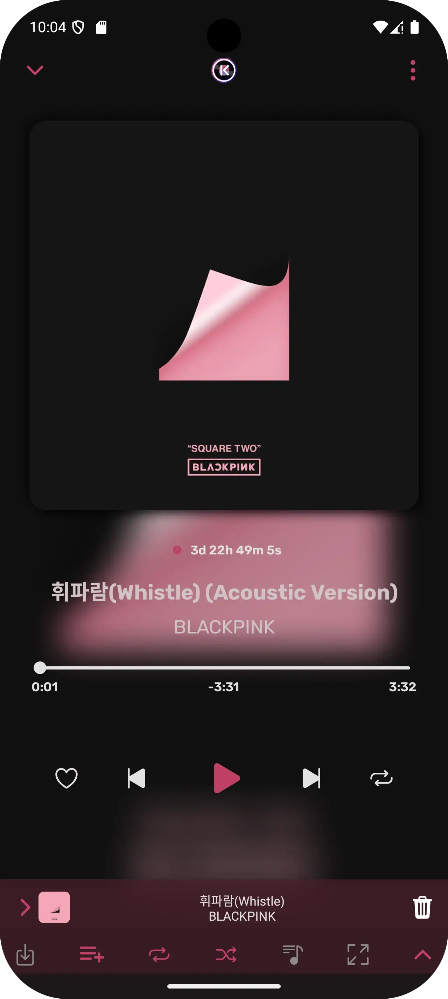
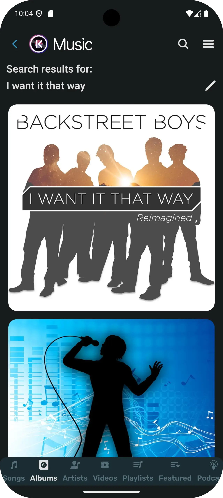
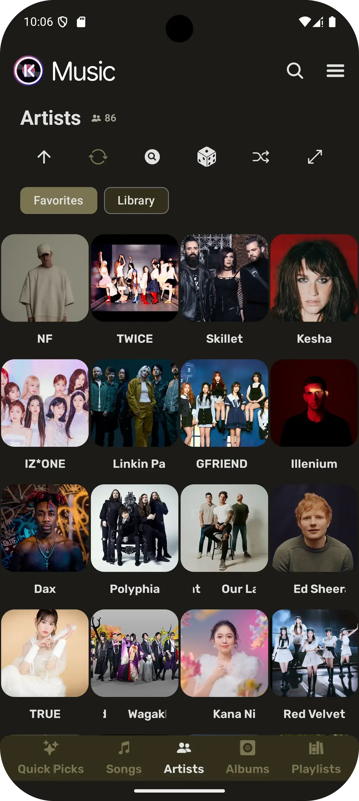

      
  

    <b>Kreate</b> is a <a href="https://github.com/fast4x/RiMusic">RiMusic</a> folk with performance in mind
  

# ❗ IMPORTANT

Since `January 5th 2025`, this project is split into 2 parts, **_upstream_** and **_improvised_**.

### ⇄ What's the different

| Upstream               | Improvised                   |
|------------------------|------------------------------|
| Bleeding-edge features | Optimized for performance    |
| Contains minor changes | Contains significant changes |
| Fast to deliver        | Takes a while to implement   |

## 📖 What is KBuild

KBuild started as an unstable branch of RiMusic with changes made before pushing to upstream branch.

After some time, changes are too many to be able to merge into upstream, causing diversion between
branches. This is extremely hard to maintain since I (most likely) have to re-write changes if there's some major
changes happen in the upstream branch. 

Therefore, **_improvised_** flavor is introduced. This will help me keep track of upstream branch while
letting me port some (or most) of new changes to legacy _kbuild_ flavor.

## ✨ Features
- **Multilingual:** English, Italian, German, Russian, French, Spanish, Czech, Turkish, Romanian and more. Contributions for other languages are welcome
- UI Mode, swtich from RiMusic to classic ViMusic style, viceversa
- Auto cache songs for offline playback with a custom cache size
- Download songs or entire playlists for offline playback (not cache) 
- Background playback
- Listening statistics
- Audio visualizer on player with many type of effects.
  - THIS FEATURE REQUIRES MIC PERMISSION, ONLY AVAILABLE IF ACTIVATED FROM SETTINGS. [Full list of permissions](https://github.com/fast4x/RiMusic/wiki/FAQs#what-permissions-are-used)
- News, mood, musical genres, new albums from favourite artists
- Import/Export online, RiMusic playlists, can share with friend all RiMusic playlists
- Fetch, display, edit, translate synchronized, or not, songs lyrics
- Customizable themes
- Sleep timer with customizable time
- Audio control: volume app, device, playback speed, pitch, normalization, skip silence
- Android Auto, Android TV, YT Video support
- Widgets (experimental)
- Check for Updates, which can be enabled or disabled in settings

## 📷 Screenshots

  
  
  

## 🌐 Languages available
- **Afrikaans** thanks to [HelloZebra1133](https://crowdin.com/profile/HelloZebra1133)
- **Arabic:** thanks to [ABS zarzis](https://crowdin.com/profile/abszar), [Ahmad Al Juwaisri](https://crowdin.com/profile/juwaisri)
- **Azerbaijani** thanks to [Nizami Səmidov](https://crowdin.com/profile/nizamismidov4), [Notesuree](https://github.com/Notesuree)
- **Bangla:** thanks to [Ann Naser Nabil](https://github.com/AnnNaserNabil)
- **Bashkir:** thanks to [Shilave malay](https://crowdin.com/profile/Bash.boy)
- **Catalan:** thanks to [Adrià Martínez](https://crowdin.com/profile/marxally), [Aniol](https://crowdin.com/profile/aniol), [EMC_Translator](https://crowdin.com/profile/EMC_Translator)
- **Chinese Simplified:** thanks to [benhaotang](https://crowdin.com/profile/benhaotang), [SharkChan0622](https://github.com/SharkChan0622)
- **Chinese Traditional:** thanks to [YeeTW](https://github.com/yjcTW), [SharkChan0622](https://github.com/SharkChan0622)
- **Czech:** thanks to [ikanakova](https://github.com/ikanakova), [JZITNIK-github](https://github.com/JZITNIK-github)
- **Danish** thanks to [cultcats](https://crowdin.com/profile/cultcats)
- **Dutch:** thanks to [BabyBenefactor](https://crowdin.com/profile/BabyBenefactor)
- **English:** thanks to [Alejandro Moctezuma](https://crowdin.com/profile/alejandromoc), [twistios](https://crowdin.com/profile/twistios), [Smk90](https://crowdin.com/profile/smk90), [CanIn](https://crowdin.com/profile/canin), [koliwan](https://crowdin.com/profile/koliwan), [Glich440](https://github.com/Glich440), [fast4x](https://github.com/fast4x)
- **Esperanto:** thanks to [kefiiris](https://github.com/kefiiris)
- **Estonian** thanks to [beez276](https://crowdin.com/profile/beez276)
- **Filipino** thanks to [Clyde-Timonera](https://github.com/Clyde-Timonera)
- **Finnish:** thanks to [Smk90](https://crowdin.com/profile/smk90), [rikalaj](https://crowdin.com/profile/rikalaj)
- **French:** thanks to [Mickael81](https://crowdin.com/profile/mickael81), [esophagusdecency](https://crowdin.com/profile/esophagusdecency), [Mickael81](https://github.com/Mickael81), [NEVARLeVrai](https://github.com/NEVARLeVrai)
- **Galician:** thanks to [zordor](https://crowdin.com/profile/zordor), [ninjum](https://crowdin.com/profile/ninjum)
- **German:** thanks to [twistqj](https://crowdin.com/profile/twistqj), [nitro4542](https://crowdin.com/profile/nitro4542), [twistios](https://crowdin.com/profile/twistios), [Eddisch](https://crowdin.com/profile/eddisch2010), [materialred](https://crowdin.com/profile/materialred), [OlimitLolli](https://crowdin.com/profile/OlimitLolli), [Lolozweipunktnull](https://crowdin.com/profile/Lolozweipunktnull), [Seryoga1984](https://crowdin.com/profile/Seryoga1984), [Conk](https://crowdin.com/profile/conk), [siggi1984](https://github.com/siggi1984)
- **Greek:** thanks to [Marinkas](https://github.com/Marinkas)
- **Hebrew:** thanks to [opcitgv](https://crowdin.com/profile/opcitgv), [TheCreeperDuck](https://crowdin.com/profile/thecreeperduck)
- **Hindi:** thanks to [NikunjKhangwal](https://crowdin.com/profile/nikunjkhangwal), [Sharunkumar](https://crowdin.com/profile/sharunkumar), [Th3-C0der](https://github.com/Th3-C0der)
- **Hungarìan:** thanks to [Zan1456](https://crowdin.com/profile/Zan1456), [Ndvok](https://crowdin.com/profile/ndvok)
- **Italian:** thanks to [Fabio Iotti](https://crowdin.com/profile/bruce965), [agefcgo](https://crowdin.com/profile/agefcgo), [CiccioDerole](https://crowdin.com/profile/CiccioDerole), [fast4x](https://github.com/fast4x)
- **Indonesian:** thanks to [luthfialfarabi](https://crowdin.com/profile/luthfialfarabi), [teddysulaimanGL](https://github.com/teddysulaimanGL), [Fausta Ahmad](https://crowdin.com/profile/faustaahmad)  
- **Interlingua** thanks to [softinterlingua](https://github.com/softinterlingua)
- **Japanese:** thanks to [maboroshin](https://crowdin.com/profile/maboroshin), [Mid_Vur_Shaan](https://crowdin.com/profile/Mid_Vur_Shaan)
- **Malayalam** thanks to [XDreamist](https://crowdin.com/profile/xdreamist)
- **Korean:** thanks to [ZeroZero00](https://crowdin.com/profile/ZeroZero00), [TsyQax](https://crowdin.com/profile/TsyQax)
- **Norwegian:** thanks to [Xyrcon](https://crowdin.com/profile/xyrcon)
- **Odia:** thanks to [redpanda9348](https://crowdin.com/profile/redpanda9348), [Get100percent](https://github.com/Get100percent)
- **Persian:** thanks to [CUMOON](https://github.com/CUMOON)
- **Polish:** thanks to [Krzysztof](https://crowdin.com/profile/scrummybingus), [severitysingular](https://crowdin.com/profile/severitysingular), [Zduniusz](https://crowdin.com/profile/zduniusz), [AntoniNowak](https://crowdin.com/profile/AntoniNowak), [roklc](https://github.com/roklc), [Adam Kop](https://crowdin.com/profile/damianadam000)
- **Portuguese:** thanks to [Juan Ignacio Tejera](https://crowdin.com/profile/originaljuani), [ManuelCoimbra](https://crowdin.com/profile/ManuelCoimbra), [NEVARLeVrai](https://github.com/NEVARLeVrai)
- **Portuguese, Brazilian:** thanks to [vs-machado](https://crowdin.com/profile/vs-machado), [luxdev01](https://crowdin.com/profile/luxdev01), [VitoriaLima1802](https://crowdin.com/profile/vitorialima1802), [xSyntheticWave](https://crowdin.com/profile/xSyntheticWave), [RegularWater](https://crowdin.com/profile/RegularWater), [NEVARLeVrai](https://github.com/NEVARLeVrai)
- **Romanian:** thanks to [OrangeZXZ](https://github.com/OrangeZxZ)
- **Russian:** thanks to [Eddisch](https://crowdin.com/profile/eddisch2010), [Michael Müller](https://crowdin.com/profile/xqzme1337), [HighMode](https://crowdin.com/profile/highmode), [koliwan](https://crowdin.com/profile/koliwan), [Nebula-Mechanica](https://crowdin.com/profile/Nebula-Mechanica), [Alnoer](https://crowdin.com/profile/Alnoer), [kptmx](https://crowdin.com/profile/kptmx), [Crayz310](https://github.com/Crayz310), [Vladimir](https://crowdin.com/profile/vladimir15426), [@siggi1984](https://github.com/siggi1984)
- **Serbian (Cyrillic, Latin)** thanks to [IvanMaksimovic77](https://github.com/IvanMaksimovic77)
- **Spanish:** thanks to [MS-PC](https://crowdin.com/profile/ms-pc), [Alejandro Moctezuma](https://crowdin.com/profile/alejandromoc), [Juan Ignacio Tejera](https://crowdin.com/profile/originaljuani), [iOSStarWorld](https://crowdin.com/profile/iosstarworld), [Corotyest](https://crowdin.com/profile/corotyest), [DanielSevillano](https://github.com/DanielSevillano), [Fabian Urra](https://crowdin.com/profile/nsagcl)
- **Sinhala:** thanks to [VINULA2007](https://crowdin.com/profile/VINULA2007)
- **Swedish:** thanks to [sebbe.ekman](https://crowdin.com/profile/sebbe.ekman), [Dženan](https://crowdin.com/profile/Dženan)
- **Tamil** thanks to [Vignesh-p-s](https://crowdin.com/profile/vignesh-p-s)
- **Turkish:** thanks to [abfreeman](https://github.com/abfreeman), [2010furs](https://github.com/2010furs), [Muha Aliss](https://crowdin.com/profile/muhaaliss)
- **Telugu** thanks to [SureshTimma](https://crowdin.com/profile/sureshtimma)
- **Ukrainian:** thanks to [Avin](https://crowdin.com/profile/avinateachip), [Michael Müller](https://crowdin.com/profile/xqzme1337), [NiXT0y](https://crowdin.com/profile/nixt0y), [Crayz310](https://github.com/Crayz310) 
- **Vietnamese:** thanks to [teaminh](https://crowdin.com/profile/teaminh)

## 📲 Installation

## 🤝 Contributing
**Pull requests are welcome**
- If you want:
    - to **develop new functions** or **fix a bug**, fork the repository, send a pull request.
    - to **translate** or **improve a translation** read the section Translations

### 🔤 Translations

> Currently unavailable!

### 🤝 **Developer / Designer that contribute:**

<table>
<tr>
    <td align="center" style="word-wrap: break-word; width: 90.0; height: 90.0">
        <a href=https://github.com/fast4x>
            
             
            <b>Rino Russo</b>
        </a>
    </td>
    <td align="center" style="word-wrap: break-word; width: 90.0; height: 90.0">
        <a href=https://github.com/vfsfitvnm>
            
             
            <b>vfsfitvnm</b>
        </a>
    </td>
    <td align="center" style="word-wrap: break-word; width: 90.0; height: 90.0">
        <a href=https://github.com/aneesh1122>
            
             
            <b>aneesh1122</b>
        </a>
    </td>
    <td align="center" style="word-wrap: break-word; width: 90.0; height: 90.0">
        <a href=https://github.com/knighthat>
            
             
            <b>Knight Hat</b>
        </a>
    </td>
    <td align="center" style="word-wrap: break-word; width: 90.0; height: 90.0">
        <a href=https://github.com/twistios>
            
             
            <b>twistios</b>
        </a>
    </td>
    <td align="center" style="word-wrap: break-word; width: 90.0; height: 90.0">
        <a href=https://github.com/martkol>
            
             
            <b>martkol</b>
        </a>
    </td>
</tr>
<tr>
    <td align="center" style="word-wrap: break-word; width: 90.0; height: 90.0">
        <a href=https://github.com/ikanakova>
            
             
            <b>ikanakova</b>
        </a>
    </td>
    <td align="center" style="word-wrap: break-word; width: 90.0; height: 90.0">
        <a href=https://github.com/NEVARLeVrai>
            
             
            <b>NΞVΛR</b>
        </a>
    </td>
    <td align="center" style="word-wrap: break-word; width: 90.0; height: 90.0">
        <a href=https://github.com/Abhinavreddy-B>
            
             
            <b>Abhinav Reddy Boddu</b>
        </a>
    </td>
    <td align="center" style="word-wrap: break-word; width: 90.0; height: 90.0">
        <a href=https://github.com/jzitnik-dev>
            
             
            <b>Jakub Žitník</b>
        </a>
    </td>
    <td align="center" style="word-wrap: break-word; width: 90.0; height: 90.0">
        <a href=https://github.com/OrangeZXZ>
            
             
            <b>OrangeZXZ</b>
        </a>
    </td>
    <td align="center" style="word-wrap: break-word; width: 90.0; height: 90.0">
        <a href=https://github.com/siggi1984>
            
             
            <b>siggi1984</b>
        </a>
    </td>
</tr>
<tr>
    <td align="center" style="word-wrap: break-word; width: 90.0; height: 90.0">
        <a href=https://github.com/DanielSevillano>
            
             
            <b>Daniel</b>
        </a>
    </td>
    <td align="center" style="word-wrap: break-word; width: 90.0; height: 90.0">
        <a href=https://github.com/KyNarec>
            
             
            <b>KyNarec</b>
        </a>
    </td>
    <td align="center" style="word-wrap: break-word; width: 90.0; height: 90.0">
        <a href=https://github.com/coolcarp>
            
             
            <b>coolcarp</b>
        </a>
    </td>
    <td align="center" style="word-wrap: break-word; width: 90.0; height: 90.0">
        <a href=https://github.com/kaanelloed>
            
             
            <b>David</b>
        </a>
    </td>
    <td align="center" style="word-wrap: break-word; width: 90.0; height: 90.0">
        <a href=https://github.com/S0nter>
            
             
            <b>Sonter</b>
        </a>
    </td>
    <td align="center" style="word-wrap: break-word; width: 90.0; height: 90.0">
        <a href=https://github.com/AnnNaserNabil>
            
             
            <b>Ann Naser Nabil</b>
        </a>
    </td>
</tr>
<tr>
    <td align="center" style="word-wrap: break-word; width: 90.0; height: 90.0">
        <a href=https://github.com/DarkCrypt>
            
             
            <b>DarkCrypt</b>
        </a>
    </td>
    <td align="center" style="word-wrap: break-word; width: 90.0; height: 90.0">
        <a href=https://github.com/muhaaliss>
            
             
            <b>Muha Aliss</b>
        </a>
    </td>
    <td align="center" style="word-wrap: break-word; width: 90.0; height: 90.0">
        <a href=https://github.com/sayyid5416>
            
             
            <b>Sayyid</b>
        </a>
    </td>
    <td align="center" style="word-wrap: break-word; width: 90.0; height: 90.0">
        <a href=https://github.com/bbyeen>
            
             
            <b>Matt</b>
        </a>
    </td>
    <td align="center" style="word-wrap: break-word; width: 90.0; height: 90.0">
        <a href=https://github.com/sharunkumar>
            
             
            <b>Sharun</b>
        </a>
    </td>
    <td align="center" style="word-wrap: break-word; width: 90.0; height: 90.0">
        <a href=https://github.com/leoheitmannruiz>
            
             
            <b>Leo Heitmann Ruiz</b>
        </a>
    </td>
</tr>
<tr>
    <td align="center" style="word-wrap: break-word; width: 90.0; height: 90.0">
        <a href=https://github.com/KalyaSc>
            
             
            <b>KalyaSc</b>
        </a>
    </td>
    <td align="center" style="word-wrap: break-word; width: 90.0; height: 90.0">
        <a href=https://github.com/Bnyro>
            
             
            <b>Bnyro</b>
        </a>
    </td>
    <td align="center" style="word-wrap: break-word; width: 90.0; height: 90.0">
        <a href=https://github.com/25huizengek1>
            
             
            <b>25huizengek1</b>
        </a>
    </td>
    <td align="center" style="word-wrap: break-word; width: 90.0; height: 90.0">
        <a href=https://github.com/wispl>
            
             
            <b>wispl</b>
        </a>
    </td>
    <td align="center" style="word-wrap: break-word; width: 90.0; height: 90.0">
        <a href=https://github.com/Craeckie>
            
             
            <b>Craeckie</b>
        </a>
    </td>
    <td align="center" style="word-wrap: break-word; width: 90.0; height: 90.0">
        <a href=https://github.com/offa>
            
             
            <b>offa</b>
        </a>
    </td>
</tr>
<tr>
    <td align="center" style="word-wrap: break-word; width: 90.0; height: 90.0">
        <a href=https://github.com/lrusso96>
            
             
            <b>Luigi Russo</b>
        </a>
    </td>
    <td align="center" style="word-wrap: break-word; width: 90.0; height: 90.0">
        <a href=https://github.com/locxter>
            
             
            <b>Luca Schultz</b>
        </a>
    </td>
    <td align="center" style="word-wrap: break-word; width: 90.0; height: 90.0">
        <a href=https://github.com/davidsalido>
            
             
            <b>davidsalido</b>
        </a>
    </td>
    <td align="center" style="word-wrap: break-word; width: 90.0; height: 90.0">
        <a href=https://github.com/ARBoyGo>
            
             
            <b>ARBoyGo</b>
        </a>
    </td>
    <td align="center" style="word-wrap: break-word; width: 90.0; height: 90.0">
        <a href=https://github.com/Surendrajat>
            
             
            <b>Surendrajat</b>
        </a>
    </td>
    <td align="center" style="word-wrap: break-word; width: 90.0; height: 90.0">
        <a href=https://github.com/sriio>
            
             
            <b>Sylvain Rio</b>
        </a>
    </td>
</tr>
<tr>
    <td align="center" style="word-wrap: break-word; width: 90.0; height: 90.0">
        <a href=https://github.com/0x5h31d0n>
            
             
            <b>Sheldon Menezes</b>
        </a>
    </td>
    <td align="center" style="word-wrap: break-word; width: 90.0; height: 90.0">
        <a href=https://github.com/roklc>
            
             
            <b>Rokic</b>
        </a>
    </td>
    <td align="center" style="word-wrap: break-word; width: 90.0; height: 90.0">
        <a href=https://github.com/RohanTemgire>
            
             
            <b>RohanTemgire</b>
        </a>
    </td>
    <td align="center" style="word-wrap: break-word; width: 90.0; height: 90.0">
        <a href=https://github.com/Poussinou>
            
             
            <b>Poussinou</b>
        </a>
    </td>
    <td align="center" style="word-wrap: break-word; width: 90.0; height: 90.0">
        <a href=https://github.com/ov1d1u>
            
             
            <b>Ovidiu D. Nițan</b>
        </a>
    </td>
    <td align="center" style="word-wrap: break-word; width: 90.0; height: 90.0">
        <a href=https://github.com/iscle>
            
             
            <b>Iscle</b>
        </a>
    </td>
</tr>
<tr>
    <td align="center" style="word-wrap: break-word; width: 90.0; height: 90.0">
        <a href=https://github.com/TheRedCyclops>
            
             
            <b>TheRedCyclops</b>
        </a>
    </td>
    <td align="center" style="word-wrap: break-word; width: 90.0; height: 90.0">
        <a href=https://github.com/eddisch>
            
             
            <b>Ed</b>
        </a>
    </td>
</tr>
</table>

## 🫂 Acknowledgements
- [**ViMusic**](https://github.com/vfsfitvnm/ViMusic)
- [**RiMusic** - Original](https://github.com/fast4x/RiMusic)
- **RiMusic current Logo Design from** [jaimtres](https://github.com/jaimtres)
- **RiMusic previous Logo, many current icons from** [@ikanakova](https://github.com/ikanakova)
- **RiMusic Website, other features from** [JZITNIK-github](https://github.com/JZITNIK-github), [martkol](https://github.com/martkol)
- **RiMusic New player, lyrics layouts from** [aneesh1122](https://github.com/aneesh1122)
- [**YouTube-Internal-Clients**](https://github.com/zerodytrash/YouTube-Internal-Clients): A python script that discovers hidden YouTube API clients. Just a research project.
- [**Ionicons**](https://github.com/ionic-team/ionicons): Premium hand-crafted icons built by Ionic, for Ionic apps, web apps everywhere.
- [**FlatIcon.com**](https://www.flaticon.com/): Download Free Icons, Stickers for your projects. Resources made by, for designers.
- [**Translator**](https://github.com/therealbush/translator): A simple, free Google Translate library for Kotlin/JVM, Java.
- [**KuGou**](https://www.kugou.com): Lyrics provider
- [**LrcLib**](https://lrclib.net): Lyrics provider
- [**HypnoticCanvas**](https://mikepenz.github.io/HypnoticCanvas/): A shader modifier for Compose Multiplatform / Jetpack Compose

## ⚠️ Disclaimer

This project is built on top of [RiMusic](https://github.com/fast4x/RiMusic) but has no relation to the original author.
Furthermore, its contents are not affiliated with, funded, authorized, endorsed by, or in any way associated with YouTube, 
Google LLC or any of its affiliates, subsidiaries.

Any trademark, service mark, trade name, or other intellectual property rights used in this project are owned by the respective owners.
